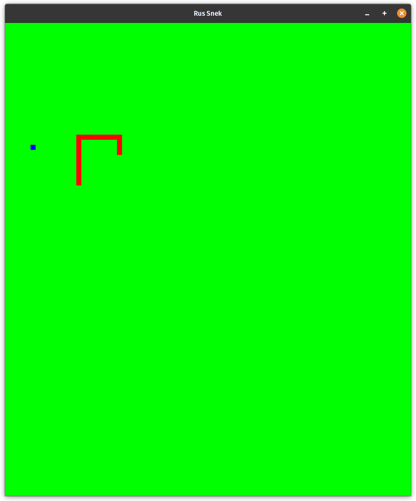

# Rus Snek

This is a simple implementation of the classic Snake game written in Rust with
the Piston game engine.

## Running
Download the Linux binary file from releases. You might need to make the file executable before running with `sudo chmod +x RusSnek`.

## Building
`cd` into the directory and run `cargo build` (assuming you already have Rust
installed on your system). 
